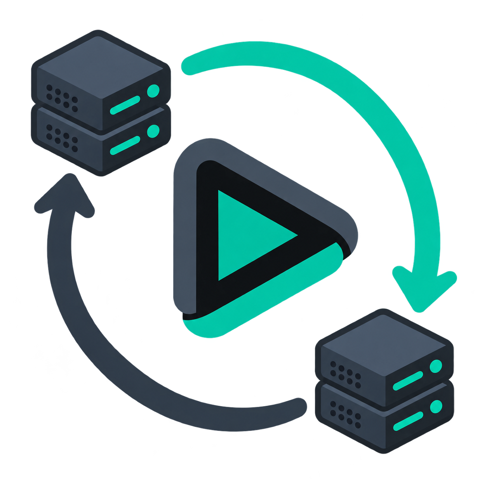

# Failovarr

> **Work in Progress / Development Preview — not production ready.**
>
> Failovarr is an **AI-assisted vibe coding project under human direction**.
> Automated checks and human acceptance reduce risk; they are not an
> independent security or reliability audit.

Failovarr is a Dispatcharr plugin for controlled active/passive configuration
replication between independent Dispatcharr installations. One node is
authoritative; Followers verify, preview and selectively apply signed bundles.
It is not Active/Active database replication and it does not provide automatic
unplanned failover.

## Safety model

- Stable record IDs, channel UUIDs and output-profile IDs are preserved, so
  client M3U and EPG URLs can survive a verified handoff.
- A Main exports the complete supported graph. Each Follower independently
  selects its local import scope and can retain hardware-specific records.
- HMAC-SHA256 signatures, monotonic sequence numbers, replay protection,
  preview/conflict checks and one transaction protect an import.
- Users, API keys, EPG programme caches, runtime data, backups and third-party
  plugin settings are not replicated.

## Supported modes and storage

Cold Standby, an online Linux client VIP, and a user-provided HA reverse proxy
are supported deployment models. The online models require distinct node
management addresses. A two-node deployment still needs external fencing or a
witness before any automatic promotion can be considered safe.

Supported storage: filesystem bind mount, WebDAV, S3-compatible object
storage, SFTP with strict host-key verification, and encrypted SMB.

## Installation

1. Download `failovarr-<version>.zip` and its `.sha256` companion from
   [Releases](https://github.com/nilleiz/failovarr/releases).
2. Verify the checksum, import the ZIP in **Dispatcharr → Settings → Plugins**
   and enable **Failovarr**.
3. Publish port **9192** if the Assistant or online peer access must leave the
   container network.
4. In **Plugins → Failovarr → Actions**, choose **Open setup assistant**.

The shared port serves the Assistant, authenticated Direct Pull and readiness;
there is no separate setup port. Native Plugin Settings mirror safe,
non-secret values; secrets and SFTP private keys remain node-local.

## Getting Started

Configure Main first, export its profile and test its storage. Import that
profile on the Follower, choose a local import preset/protection policy, test
storage, then request a Main export. On the Follower verify the bundle, preview
it and import it. Full instructions are in the
[Getting Started guide](docs/wiki/Getting-Started.md).

## Feature status

The canonical [feature catalogue](docs/FEATURES.md) separates verified work,
implemented work awaiting further verification, and planned work. It is also
available through the public Wiki once initialized.

## Upgrade from Dispatcharr Redundancy

Disable the old plugin before enabling Failovarr. Failovarr can read legacy
configuration profiles and migrates an existing node-local configuration to a
new Failovarr path without deleting the source. Verify the migrated settings
and a preview before removing the old plugin. Never run both plugin identities
at the same time.

## Community and licence

Please read [CONTRIBUTING](CONTRIBUTING.md), [SECURITY](SECURITY.md), the
[third-party notices](docs/third-party-notices.md), and the [MIT licence](LICENSE).
Official Dispatcharr registry submission is deliberately deferred until a
stable, independently reviewed release.
